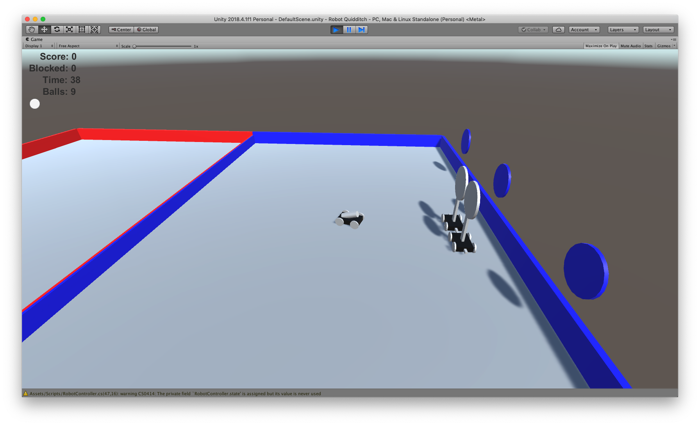

Robot Quidditch
===============

I have developed this game for the 2018-2019
[Verizon Innovative Learning Progam](https://verizoninnovativelearning.com)
hosted at [Kentucky State University](http://www.kysu.edu),
where I teach computer science and video game development.

This game is part of the larger project in collaboration with
[Newton's Attic](http://newtonsattic.org),
in which middle schoolers actually built and the game in the real world.
During the program,
it served as a prototyping tool for students,
so that they could test the characteristics of the robots,
the layout of the arena,
and the gameplay before actually building the real objects.

The objective is
to load a remote-controlled attacking robot with practice golf balls
by maneuvering to the reload area on the playing field.
Once loaded,
the balls are shot towards the three hoops at the end zone.
Autonomous defending robots try to detect the presence of the attacker,
and try to move to block the shot,
following a simple algorithm.

Students also learned how to write a scorekeeping app using Python.
